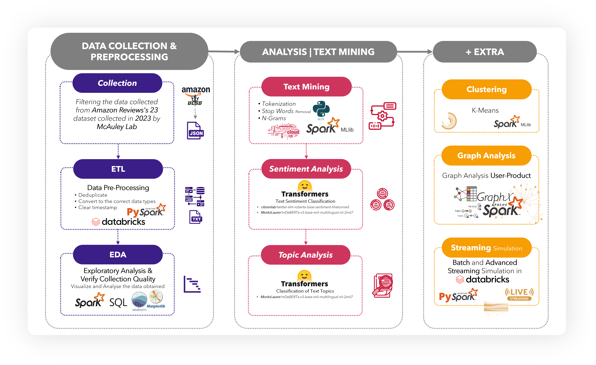

# 🛍️ Modelling Amazon Tech Reviews for Consumer Insight 💻️

    

    

## **📝 Description**

This project aims to analyse consumer purchasing behaviour by exploring user reviews from Amazon’s Electronics, Computers category between 2022 and 2023. 

The dataset, sourced from  [McAuley Lab’s Amazon Reviews 2023 collection](https://amazon-reviews-2023.github.io/), includes over 571M reviews. Leveraging the Databricks environment with Apache Spark as the Big Data processing engine and Transformer-based models, we performed sentiment and topic analysis, clustering of product reviews, and graph analysis to understand the competitiveness between products within this e-commerce sector and analyse consumer behaviour. 

Throughout the project, we relied on PySpark as our core API to interact with Spark components such as Spark SQL, MLlib, Streaming, and GraphFrames.

## **✨ Objective**

The primary objectives of this project are to:

-   **Extract and process** data from Amazon Reviews '23, specifically targeting *Computer* Products in the *Electronics* category.
-   **Conduct sentiment analysis** utilizing pre-trained Transformer-based models ([TX-RoBERTa](https://huggingface.co/citizenlab/twitter-xlm-roberta-base-sentiment-finetunned) and [mDeBERTa](https://huggingface.co/MoritzLaurer/mDeBERTa-v3-base-xnli-multilingual-nli-2mil7)) to classify the sentiment expressed in user reviews.
-   **Identify key trends** by uncovering trending topics and themes within computer product reviews to understand consumer preferences and concerns.
-   **Perform clustering analysis** on product reviews to identify distinct segments.
-   **Conduct graph analysis** (PageRank, Label Propagation) to understand user-product interactions, influential nodes, and communities.
-   **Simulate and process streaming data** using Spark Streaming.
-   **Provide actionable insights** by synthesizing findings into meaningful insights for businesses and stakeholders.

## **📚 Context**

This project was developed for the **Big Data Analytics** course in the **[Master's in Data Science and Advanced Analytics](https://www.novaims.unl.pt/en/education/programs/postgraduate-programs-and-master-degree-programs/master-degree-program-in-data-science-and-advanced-analytics-with-a-specialization-in-data-science/)** program at **NOVA IMS**, during the **2nd Semester** of the 2024-2025 academic year.

    
    

## **🏗️ Project Workflow & Technologies**

The project followed the **CRISP-DM** methodology, executed within a distributed computing environment.

    

<b>Figure 1:</b> Project Flowchart.

1.  **Business & Data Understanding (Notebook `0_DataCollection` & `1_BU&EDA`):** 💡
    *   **Problem Definition**: Analyze consumer purchasing behaviour and product competitiveness in the Amazon Electronics (Computers) sector using reviews from 2022-2023.
    *   **Data Source**: Amazon Reviews 2023 dataset (Electronics category).
    *   **Initial Exploration**: Understand dataset attributes, size, and structure. Identify key data fields for reviews and product metadata.

    

        
        
        
        
    

2.  **Data Collection & Preprocessing (Notebook `0_DataCollection` & `1_BU&EDA`):** ⚙️
    *   Obtain and load the large dataset into the Databricks environment.
    *   Clean and preprocess the data using PySpark: handle missing values, convert data types (e.g., timestamp), filter relevant data (reviews from 2022-2023, 'Computers' category).
    *   Feature engineering: e.g., creating a combined text field from review title and body.
    
    

        
        
        
        
        
        
        
    

3.  **Sentiment & Topic Analysis (Notebook `2_TextAnalysis`):** 🗣️
    *   Apply pre-trained Transformer models (TX-RoBERTa and mDeBERTa) for sentiment classification (Positive, Neutral, Negative) on review text.
    *   Combine outputs from both models to create a robust sentiment score.
    *   Perform topic analysis (e.g., using mDeBERTa zero-shot classification) on product titles to identify product categories.
    *   Analyze sentiment distribution across different topics/products.

    

        
        
        
    

4.  **Streaming Simulation (Notebook `3.1_ModellingStreamingSimulation`):** 🌊
    *   Simulate a streaming scenario by processing review data in chunks.
    *   Apply sentiment analysis models to incoming data streams using Spark Streaming.
    *   Demonstrate capabilities for near real-time processing and analysis.

    

        
        
    

5.  **Clustering Analysis (Notebook `5_ClusteringAnalysis`):**  clust.
    *   Perform clustering (e.g., K-Means) on product reviews based on selected features (e.g., TF-IDF of review text, sentiment scores, product metadata).
    *   Identify and profile distinct customer/product segments.
    *   (Self-correction based on OCR'd pages: The clustering appears to be based on product features and review sentiment, aiming to group products or understand review patterns rather than customer segmentation directly from review text alone). PCA was explored.

    

        
        
    

6.  **Graph Analysis (Notebook `6_GraphAnalysis`):** 🔗
    *   Construct a graph of user-product interactions using GraphFrames.
    *   Apply PageRank algorithm to identify influential products and users.
    *   Use Label Propagation algorithm to detect communities within the review network.

    

        
        
        
    

7.  **Results Analysis & Visualization (Notebook `4_ResultsAnalysis` and throughout):** 📊📈
    *   Analyze results from sentiment, topic, clustering, and graph analyses.
    *   Visualize findings using dashboards, charts, and tables (e.g., sentiment distribution, topic trends, cluster profiles, PageRank distributions, community structures).
    *   Synthesize insights to address the project's objectives.

    

        
        
        
    

## **📈 Key Results**

-   Successfully processed and analyzed a large subset of the Amazon Reviews dataset.
-   Applied advanced NLP models for sentiment and topic classification in a distributed environment.
-   Identified influential products and user communities through graph analysis.
-   The clustering solution achieved an **R² of 0.80**, indicating a strong separation and clear definition between the identified product/review clusters.

## **📚 Conclusion & Future Work**

This project demonstrates a robust, end-to-end Big Data analytics pipeline. The combination of Spark, advanced ML models, and graph analytics provided deep insights into consumer behavior and product competitiveness on Amazon.

**Future work could include:**
*   Building predictive models for sales forecasting based on review trends.
*   Developing a product recommendation system using the clustering and graph analysis results.
*   Expanding the analysis to other product categories or timeframes.

Dive into our notebooks to see the data magic unfold! 🪄 Fair warning: your Amazon cart might just start recommending itself... 🛒💸

## **📂 Notebooks Structure**

The project is organized into several Databricks notebooks, each focusing on a specific stage of the pipeline. Pre-executed HTML versions are available in the repository for easy viewing.

0.  **Data Collection & Initial Setup**
    *   [`0_DataCollection_BDAProject_Group37_DataBricks.ipynb`](./0_DataCollection_BDAProject_Group37_DataBricks.ipynb)
1.  **Business and Data Understanding & Exploratory Data Analysis (EDA)**
    *   [`1_BU&EDA_BDAProject_Group37_DataBricks.ipynb`](./1_BU&EDA_BDAProject_Group37_DataBricks.ipynb)
2.  **Text Analysis** (WordCloud, Number of Important Words)
    *   [`2_TextAnalysis_BDAProject_Group37_DataBricks.ipynb`](./2_TextAnalysis_BDAProject_Group37_DataBricks.ipynb)
3.  **Modelling (Sentiment & Topic) & Streaming Simulation**
    *   [`3_Modelling_BDAProject_Group37_Colab.ipynb`](./3_Modelling_BDAProject_Group37_Colab.ipynb)
    *   [`3.1_ModellingStreamingSimulation_BDAProject_Group37_DataBricks.ipynb`](./3.1_ModellingStreamingSimulation_BDAProject_Group37_DataBricks.ipynb)
4.  **Results Analysis and Visualization**
    *   [`4_ResultsAnalysis_BDAProject_Group37_DataBricks.ipynb`](./4_ResultsAnalysis_BDAProject_Group37_DataBricks.ipynb)
5.  **Clustering Analysis**
    *   [`5_ClusteringAnalysis_BDAProject_Group37_DataBricks.ipynb`](./5_ClusteringAnalysis_BDAProject_Group37_DataBricks.ipynb)
6.  **Graph Analysis**
    *   [`6_GraphAnalysis_BDAProject_Group37_DataBricks.ipynb`](./6_GraphAnalysis_BDAProject_Group37_DataBricks.ipynb)

 

> **Note:** All notebooks were developed and executed in the **Databricks** environment (except `3_Modelling_BDAProject_Group37_Colab.ipynb`). If you prefer not to run the notebooks interactively, you can find pre-executed HTML versions of each notebook, complete with their respective results, within the repository. This allows for easy viewing of the analysis and outputs without requiring a Databricks setup.

Dive into our notebooks to see the data magic unfold! 🪄 But fair warning: your Amazon cart might start recommending itself after this... 🛒💸

 

## 👥 Team (Group 37)

- **André Silvestre** (20240502)
- **Filipa Pereira** (20240509)
- **João Henriques** (20240499)
- **Umeima Mahomed** (20240543)
